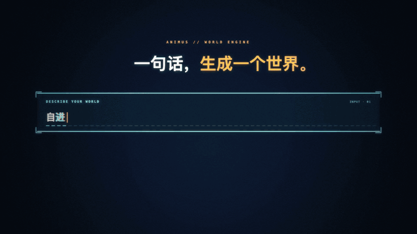

<h1 align="center">ANIMUS</h1>

<p align="center"><strong>Generate worlds. Generate challenges.</strong></p>

<p align="center">
  <a href="README.md"></a>
  <a href="README.en.md"></a>
</p>

<p align="center">Build evaluation environments driven by a shared world state, from user-defined scenarios and target capabilities.</p>

<p align="center"><a href="#demo-video">Demo video</a> · <a href="#core-capabilities">Core capabilities</a> · <a href="#quick-start">Quick start</a> · <a href="https://my.feishu.cn/wiki/UonawzqIFiLExGkXVadcdMTCnUd">Project introduction</a></p>

## Demo video

<p align="center">
  <a href="assets/readme/animus-demo.mp4"></a>
</p>

<p align="center"><a href="assets/readme/animus-demo.mp4"><strong>▶ Watch the full demo</strong></a> · <a href="https://my.feishu.cn/wiki/UonawzqIFiLExGkXVadcdMTCnUd#doxcn0oVODB0MpqfHEnxNlCkXHd">Original video in Feishu</a> (in Chinese)</p>

## Core capabilities

| | Capability | Description |
| :---: | :--- | :--- |
| **01** | **Scenario-native world modeling** | Build executable world models from domain rules and task requirements, generating mutually consistent evaluation materials. |
| **02** | **Capability-driven question generation** | Generate questions and reference answers around target capabilities, with configurable capability coverage, question counts, and data scale. |
| **03** | **An integrated interface from generation to evaluation** | Filter questions through model trial runs, export standardized benchmark packages, and evaluate complete Agent systems for accuracy, failure types, and usage costs. |

<p align="center"><strong>Define scenarios and capabilities → Build worlds → Generate questions → Filter through trial runs → Export and evaluate</strong></p>

## Evaluation results

<details>
<summary>Explore model results and capability coverage across four domains and 240 questions</summary>


### Model evaluation results

These charts show an **archived selected sample of 240 questions** from generation runs across legal, finance, forensic, and insurance domains. Results come from archived four-model evaluation records and show correct counts, accuracy, and capability profiles.

<p align="center">
  <a href="assets/readme/01_performance_dashboard.png"></a>
</p>

*Figure 1 | Overall and component results for four model configurations. Click to open the original image at 2880 pixels wide. Chart labels are in Chinese.*

### Question coverage and capability results

The upper panel shows the question distribution across domains and capability categories. The lower panel reports each model's correct counts and accuracy by capability, so results can be read alongside sample sizes.

<p align="center">
  <a href="assets/readme/02_coverage_and_capabilities.png"></a>
</p>

*Figure 2 | Domain and capability coverage, followed by capability-level evaluation results. The three case studies below come from this 240-question sample.*

</details>

## Quick start

<details>
<summary>Expand the installation, configuration, and generation guide (Python 3.10+)</summary>


This path uses a V2 target to generate corpus material and candidate questions, then complete quality review. It requires **Python 3.10+**. Run commands from the repository root; on Linux/macOS, use `./venv/bin/python` as the interpreter.

### 1. Install and configure

```bash
git clone https://github.com/theseus-labs-rsi/Animus.git
cd Animus
```

Windows PowerShell:

```powershell
python -m venv venv
.\venv\Scripts\python.exe -X utf8 -m pip install -r requirements-minimal.txt
Copy-Item .env.example .env
```

<details>
<summary>Linux / macOS installation commands</summary>

```bash
python3 -m venv venv
./venv/bin/python -X utf8 -m pip install -r requirements-minimal.txt
cp .env.example .env
```

</details>

Set `OPENAI_API_KEY`, `OPENAI_BASE_URL`, and `MODEL` in `.env`. `STRUCTURE_MODEL` can select a separate world design model.

### 2. Prepare the seed and generation target

Save your domain seed as `path/to/seed.json`. Start from the repository's [synthetic seed example](skills/realfiles-to-seedjson/examples/seed_v2_example.json), or prepare your own material using the [schema](schemas/seed_pack_v2.schema.json) and [conversion guide](skills/realfiles-to-seedjson/SEEDJSON_GUIDE.md).

The seed supplies domain context and constraints; the target file specifies question count and corpus size. The whitepaper uses these inputs to design entities, relations, and business processes over time. The program then validates and executes the instance plan.

Save this V2 target as `path/to/target.json`: **200 candidates** evenly allocated across seven lines, at least **100,000 formal-document tokens**, at least **one million total corpus tokens**, and a haystack-to-formal token ratio of at least **9:1**.

```json
{
  "version": 2,
  "count_stage": "generation_quality",
  "candidate_questions": 200,
  "requested_lines": [
    "L1_timeline", "L2_relational", "L3_process", "L5_conflict",
    "L6_refusal", "L7_consolidation", "L8_transition"
  ],
  "core_tokens": 100000,
  "corpus_tokens": 1000000,
  "filler_ratio": 9,
  "tokenizer": "cl100k_base@0.12.0",
  "max_supply_rounds": 3
}
```

### 3. Start generation

```powershell
.\venv\Scripts\python.exe -X utf8 tools/validate_seed_packs.py path/to/seed.json --require-generation-ready
.\venv\Scripts\python.exe -X utf8 -m pipeline.factory --seed-pack path/to/seed.json --delivery-target path/to/target.json --process-questions --semantic-workers 4
```

The pipeline plans supply by line, generates the world, disclosure schedule, and question orders, then checks orders and produces formal documents and haystack material. Question wording, grounding, and quality review follow. This command stops at `quality` by default.

### 4. Inspect outputs and target attainment

Results are saved in `output/runs/<run_id>/`:

| File | Contents |
|---|---|
| `manifest.json`, `11_production.json` | Stage status, frozen configuration, and supply rounds |
| `01_whitepaper.json`, `02_world.json` | World design and executed business facts |
| `03_orders.json`, `04_questions.json` | Question orders and formed candidates |
| `05_corpus.json`, `05_corpus_token_scale.json` | Corpus documents and actual token counts for formal documents and haystack |
| `06_grounded_questions.json`, `07_release.json` | Grounded questions, question review results, and quality eligibility |
| `08_calibration.json`, `09_selection.json` | Four-model evaluation status and selection results |
| `10_delivery_target.json` | Measured line counts and corpus size against the delivery target |

Review degradation preserves candidates and warnings and is reflected in quality eligibility and delivery reports. The `eligible` field in `07_release.json` records quality eligibility; `10_delivery_target.json` and `11_production.json` report target attainment. When selection yields deliverable questions, the standard package is under `delivery/<attempt>/benchmark/` within that run directory.

<details>
<summary>Optional: four-model evaluation and selection (V1 target)</summary>

Four-model evaluation also requires Node.js 22.19.0+ and npm. Install the CLIs and prepare the evaluation endpoint configuration:

```bash
npm install --global @openai/codex@0.153.2 @deepseek-ai/dsh@0.1.2-rc.1
```

```powershell
Copy-Item configs/env/secrets.env.example configs/env/secrets.env
```

Configure the four model endpoints in `configs/env/secrets.env`. The [release_four.json configuration](examples/release_four.json) specifies models and selection rules. See also the [DSH profile](configs/dsh/README.md).

Use this V1 target for at least 200 questions after four-model selection and at least one million corpus tokens, balanced across the six listed production lines. `per_line_min` and `per_line_max` can set bounds for individual lines.

```json
{
  "version": 1,
  "count_stage": "selection_complete",
  "final_questions": 200,
  "requested_lines": [
    "L1_timeline", "L2_relational", "L5_conflict",
    "L6_refusal", "L7_consolidation", "L8_transition"
  ],
  "per_line_min": {},
  "per_line_max": {},
  "corpus_tokens": 1000000,
  "tokenizer": "cl100k_base@0.12.0",
  "max_supply_rounds": 3
}
```

Start a new run with this target:

```powershell
.\venv\Scripts\python.exe -X utf8 -m pipeline.factory --seed-pack path/to/seed.json --delivery-target path/to/target.json --haystack-ratio 9 --semantic-workers 4 --release
```

V1 reserves three times the final question target by default and revises supply based on line deficits, bounded by `max_supply_rounds`. `--release` uses `examples/release_four.json` to run the four model configurations and remove questions all four answered correctly according to its configured rule.

For a completed V1 generation run, add model evaluation and selection:

```powershell
.\venv\Scripts\python.exe -X utf8 -m pipeline.factory --run <run_id> --release --from quality
```

Native four-model scoring does not yet support `L3_process_trace`, so this example uses a six-line target. Runs containing process questions can stop at `quality`. V2 uses a candidate-question target, and the CLI rejects combining it with `--release` or selection-stage options.

</details>

<details>
<summary>Resume, measurement rules, and engineering configuration</summary>

Resume a run:

```powershell
.\venv\Scripts\python.exe -X utf8 -m pipeline.factory --run <run_id>
```

Resuming uses the run's frozen seed, target, and completed stages. Checkpoints within a stage are reused after input and implementation checks. Use a new run to change the seed or delivery target. Production states such as `review_recovery_required`, `design_diagnosis_required`, or `round_limit` require resolving the recorded cause before recovery.

V2 counts candidates by line in `04_questions.json`. Grounded counts, quality eligibility, and native L7 trends are checked separately. When candidate quotas, measured corpus targets, and quality requirements are met, production status is `generation_complete`; review degradation retains artifacts and warnings.

Corpus tokens are counted from document bodies with the named tokenizer and pinned version. The V1 example's `--haystack-ratio 9` sets a character ratio of at least 9:1 between haystack and other body text. The legacy `--target-mchars` flag, including its compatibility alias `--target-mtokens`, also measures characters and cannot be combined with `--delivery-target`. V2 uses `core_tokens`, `corpus_tokens`, and `filler_ratio` in the target file to specify token scales and ratios.

`LLM_CONCURRENCY` limits model requests in flight; `--semantic-workers` controls question review parallelism (1–16). Set `LLM_DEADLINE_S` and `LLM_HTTP_READ_TIMEOUT_S` in `.env` to control each request's total deadline and HTTP read timeout. See `python -m pipeline.factory --help` for all options.

`L3_process` question generation is disabled by default. The main path explicitly enables it with `--process-questions`.

</details>

<details>
<summary>Repository layout and development checks</summary>

| Path | Contents |
|---|---|
| `pipeline/` | World, document, and question generation; quality review, selection, and export |
| `agent_harnesses/`, `eval/` | Model runners and evaluation system integrations |
| `configs/`, `schemas/`, `skills/` | Runtime configuration, seed formats, and conversion guides |
| `examples/`, `assets/readme/` | Configuration examples, case data, and result charts |
| [services/](services/README.en.md) | Optional gateways, GPU services, and evaluation scripts |
| `tools/`, `tests/` | Inspection tools and tests |

Dependency lists cover the [core environment](requirements-minimal.txt), [full evaluation environment](requirements.txt), [Mem0 integration](requirements-memory-mem0.txt), and [development checks](requirements-test.txt). Install the set needed for your workflow. With the development dependencies installed, run `python -B tools/verify_repository.py` for regression checks with external network access blocked; logs are saved in `output/repository_verification/`.

</details>

</details>

## Case studies

<details>
<summary>Explore three cases: historical conclusions, source changes, and state transitions</summary>


These three questions come from the archived 240-question sample shown in the overview. Animus generated the questions and documents. Timelines summarize the relevant records; model answers and correctness labels retain their archived values. The cases examine the queried object, effective dates, and first changes in recorded fields. Model answers retain their original Chinese wording.

### Case 1: A reopened case and its historical conclusion

Scenario: Legal / merchant compliance review · Capability: Information extraction (IE)

> In week 11, what was the review conclusion for the case “Sweetheart Dessert Shop — reopened review of supplemental ledgers”?

| Time | Relevant records, summarized |
|---|---|
| Week 5 · February 3 | The original case, “review of missing materials,” concludes that complete ledgers are still required. |
| Week 7 · February 17 | A new case for the supplemental ledgers is opened and linked to the original case. |
| Week 10 · March 10 | The license comparison record states that the shop's license is valid and a ledger conclusion is pending. |
| Week 11 · March 17 | Complete supplemental ledgers arrive and are registered as evidence awaiting review. The review conclusion is scheduled separately. |
| Week 13 · March 31 | A review record recalls the reopened case's **March 10** conclusion, “license valid; ledger conclusion pending,” and records its new March 31 conclusion, “ledgers complete; reinstatement under assessment.” |

Answer: **证照有效待台账结论** — license valid; ledger conclusion pending. The question requires identifying the reopened case and reconstructing its state in week 11.

| Model | Original answer | Result |
|---|---|---|
| GPT-5.6 | 证照有效待台账结论。 | Correct |
| DS v4.1 | 证照有效待台账结论（待台账结论，第11周补交件到达但复核结论未更新，沿用3月10日值）。 | Correct |
| GPT-5.3 | 待补证后重核 | Incorrect |
| DS 0731 | 待补交完整台账 | Incorrect |

**Analysis.** The question concerns the reopened case created in week 7 and its state in week 11. The week 13 record recalls that case's March 10 conclusion; week 11 registers the arrival of supplemental documents and schedules the review separately. Following that record chain reconstructs the requested state. DS 0731 returns the original case's week 5 conclusion.

[Inspect the source documents and four model answers](examples/case_studies.json#L6).

### Case 2: When a report becomes the adopted source

Scenario: Insurance / annual analysis report adoption · Capability: Information extraction (IE)

> In week 6, what was the adopted source for annual analysis record 11?

| Time | Relevant records, summarized |
|---|---|
| Week 5 · February 3 | An adoption record sets the source for annual analysis record 11 to S21. |
| Week 6 · February 10 | S22 arrives and is registered. The receipt log preserves the existing adopted source. |
| Week 7 · February 17 | A new adoption record changes the source to S22. |

Answer: **来源记录S21** — source record S21. S22 arrives one week before its formal adoption, so the adopted source in week 6 remains S21.

| Model | Original answer | Result |
|---|---|---|
| GPT-5.6 | 来源记录S22。 | Incorrect |
| DS v4.1 | 来源记录S21（客户11的FY2023/24暂定版，采用口径为暂定版口径）。 | Correct |
| GPT-5.3 | 来源记录S21 | Correct |
| DS 0731 | 来源记录S21 | Correct |

**Analysis.** Receipt is recorded in week 6, and formal adoption changes in week 7. The adoption records establish S21 as the source in week 6. GPT-5.6 returns S22, the source adopted from week 7 onward.

[Inspect the source documents and four model answers](examples/case_studies.json#L89).

### Case 3: The first change in evidence sufficiency

Scenario: Legal / merchant compliance review · Capability: Temporal reasoning (TR)

> In which week did evidence sufficiency first change for the case “Neighborhood Supermarket — price-label review”? Answer with the period number.

| Time | Relevant records, summarized |
|---|---|
| Week 7 · February 17 | The case is opened with evidence sufficiency initially recorded as “awaiting additional evidence.” |
| Week 9 · March 3 | Complete price-label photos arrive and are registered as evidence awaiting review. |
| Week 12 · March 24 | The review is completed and evidence sufficiency changes to “verified.” |

Answer: **Week 12**. Establish the initial value in week 7, then locate its first recorded change.

| Model | Original answer | Result |
|---|---|---|
| GPT-5.6 | 第12周。 | Correct |
| DS v4.1 | 第12周 | Correct |
| GPT-5.3 | 第12周。 | Correct |
| DS 0731 | 第7周 | Incorrect |

**Analysis.** Week 7 establishes the initial field value, week 9 records the arrival of evidence, and week 12 first changes evidence sufficiency to “verified.” Comparing successive values of the same field identifies its first change. DS 0731 returns the week of initial registration.

[Inspect the source documents and four model answers](examples/case_studies.json#L154).

</details>

---

<p align="center"><strong>What would you like to evaluate in the next world?</strong><br>Demo video and animated preview from the <a href="https://my.feishu.cn/wiki/UonawzqIFiLExGkXVadcdMTCnUd">project introduction document</a> (in Chinese).</p>
