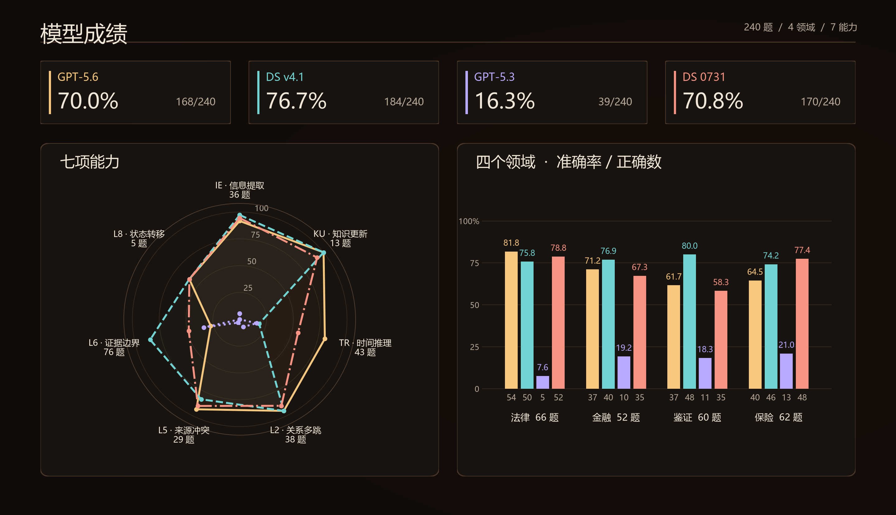
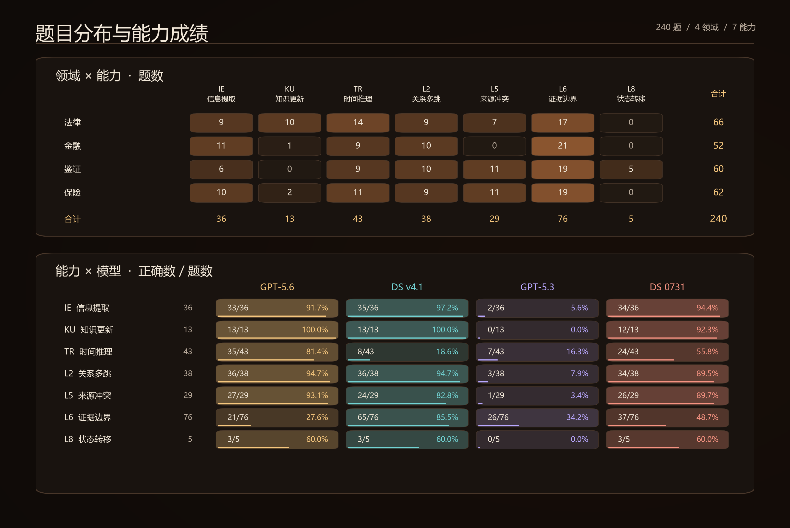

# Animus

<p align="center">
  <a href="README.md"></a>
  <a href="README.en.md"></a>
</p>

<p align="center"><strong>从领域 seed 生成随时间演变的文档语料与有材料依据的评测题。</strong></p>

<p align="center"><a href="#概览">概览</a> · <a href="#快速开始">快速开始</a> · <a href="#具体案例分析">具体案例分析</a></p>

## 概览

Animus 是一条 benchmark 生成流水线。你提供领域 seed 和题量、语料规模目标，白皮书据此规划世界与逐线供给，系统生成跨期文档、草堆和评测题，并保存材料依据与审查结果。可继续运行四模型试答、易题筛选和标准 benchmark 导出。


### 模型试答结果

下面展示既有生成期筛选样本中的 **240 道题**，覆盖法律、金融、鉴证和保险四个领域。结果来自归档的四模型试答记录；图中列出正确数、准确率与能力表现。

<p align="center">
  <a href="assets/readme/01_performance_dashboard.png"></a>
</p>

*图 1｜四模型总成绩与分项表现。点击图片可查看 2880 像素宽的原图。*

### 题目覆盖与能力表现

上半部分展示各领域的题量构成，下半部分给出四模型在各能力类别上的正确数与准确率，便于结合样本量阅读结果。

<p align="center">
  <a href="assets/readme/02_coverage_and_capabilities.png"></a>
</p>

*图 2｜领域与能力覆盖、逐能力试答成绩。后文三个案例选自这份 240 题样本。*

## 快速开始

以下路径使用 V2 目标，完成语料、候选题生成与质量审查。需要 **Python 3.10+**，在仓库根目录执行命令；使用 Linux/macOS 时，将解释器替换为 `./venv/bin/python`。

### 1. 安装与配置

```bash
git clone https://github.com/theseus-labs-rsi/Animus.git
cd Animus
```

Windows PowerShell：

```powershell
python -m venv venv
.\venv\Scripts\python.exe -X utf8 -m pip install -r requirements-minimal.txt
Copy-Item .env.example .env
```

<details>
<summary>Linux / macOS 安装命令</summary>

```bash
python3 -m venv venv
./venv/bin/python -X utf8 -m pip install -r requirements-minimal.txt
cp .env.example .env
```

</details>

在 `.env` 中填写 `OPENAI_API_KEY`、`OPENAI_BASE_URL` 和 `MODEL`。`STRUCTURE_MODEL` 可单独指定世界设计模型。

### 2. 准备 seed 与生成目标

将领域 seed 保存为 `path/to/seed.json`。可以参考仓库内的[合成 seed 示例](skills/realfiles-to-seedjson/examples/seed_v2_example.json)，或按 [schema](schemas/seed_pack_v2.schema.json) 与[转换指南](skills/realfiles-to-seedjson/SEEDJSON_GUIDE.md)整理自己的材料。

seed 提供领域背景与约束；题量和语料规模写入目标文件。白皮书根据这些输入设计实体、关系及跨期业务过程，再由程序检查并执行实例计划。

将下面的 V2 目标保存为 `path/to/target.json`：七线均分 **200 道候选题**，正式材料至少 **10 万 token**，总语料至少 **100 万 token**，草堆与正式材料的 token 比至少 **9:1**。

```json
{
  "version": 2,
  "count_stage": "generation_quality",
  "candidate_questions": 200,
  "requested_lines": [
    "L1_timeline", "L2_relational", "L3_process", "L5_conflict",
    "L6_refusal", "L7_consolidation", "L8_transition"
  ],
  "core_tokens": 100000,
  "corpus_tokens": 1000000,
  "filler_ratio": 9,
  "tokenizer": "cl100k_base@0.12.0",
  "max_supply_rounds": 3
}
```

### 3. 启动生成

```powershell
.\venv\Scripts\python.exe -X utf8 tools/validate_seed_packs.py path/to/seed.json --require-generation-ready
.\venv\Scripts\python.exe -X utf8 -m pipeline.factory --seed-pack path/to/seed.json --delivery-target path/to/target.json --process-questions --semantic-workers 4
```

系统先规划逐线供给，再生成世界、公开安排和出题订单；检查订单后生成正式材料与草堆，随后完成题目表述、材料接地和质量审查。此命令默认运行到 `quality`。

### 4. 查看产物与目标达成情况

结果保存在 `output/runs/<run_id>/`：

| 文件 | 内容 |
|---|---|
| `manifest.json`、`11_production.json` | 阶段状态、冻结配置与供给轮次 |
| `01_whitepaper.json`、`02_world.json` | 世界设计与执行后的业务事实 |
| `03_orders.json`、`04_questions.json` | 出题订单与候选题 |
| `05_corpus.json`、`05_corpus_token_scale.json` | 文档语料与正式材料、草堆的实际 token 数 |
| `06_grounded_questions.json`、`07_release.json` | 接地后题目、逐题审查结果和质量资格 |
| `08_calibration.json`、`09_selection.json` | 四模型试答状态与筛选结果 |
| `10_delivery_target.json` | 逐线题量、语料规模与交付目标的实测对照 |

审查降级会保留候选和警告，并反映在质量资格与交付报告中。`07_release.json` 的 `eligible` 记录质量资格；目标达成情况见 `10_delivery_target.json` 与 `11_production.json`。筛选得到可交付题目后，标准包位于该目录下的 `delivery/<attempt>/benchmark/`。

<details>
<summary>可选：四模型试答与筛选（V1 目标）</summary>

四模型试答还需要 Node.js 22.19.0+ 和 npm。安装 CLI，并准备试答接口配置：

```bash
npm install --global @openai/codex@0.153.2 @deepseek-ai/dsh@0.1.2-rc.1
```

```powershell
Copy-Item configs/env/secrets.env.example configs/env/secrets.env
```

在 `configs/env/secrets.env` 填写四模型接口配置；模型与筛选规则见 [release_four.json](examples/release_four.json)，另见 [DSH profile](configs/dsh/README.md)。

将目标文件改为下面的 V1 配置：四模型筛选后至少 200 题，总语料至少 100 万 token，并在列出的六条产线间均衡分配。`per_line_min`、`per_line_max` 可设置逐线题量边界。

```json
{
  "version": 1,
  "count_stage": "selection_complete",
  "final_questions": 200,
  "requested_lines": [
    "L1_timeline", "L2_relational", "L5_conflict",
    "L6_refusal", "L7_consolidation", "L8_transition"
  ],
  "per_line_min": {},
  "per_line_max": {},
  "corpus_tokens": 1000000,
  "tokenizer": "cl100k_base@0.12.0",
  "max_supply_rounds": 3
}
```

以这个目标新建运行：

```powershell
.\venv\Scripts\python.exe -X utf8 -m pipeline.factory --seed-pack path/to/seed.json --delivery-target path/to/target.json --haystack-ratio 9 --semantic-workers 4 --release
```

V1 默认预留筛后目标三倍的候选额度，并根据各线缺口补供给，轮数受 `max_supply_rounds` 限制。`--release` 使用 `examples/release_four.json` 运行四模型，并按其配置剔除全员答对的题。

已有 V1 完整生成结果时，可补做试答与筛选：

```powershell
.\venv\Scripts\python.exe -X utf8 -m pipeline.factory --run <run_id> --release --from quality
```

原生四模型评分当前尚不支持 `L3_process_trace`，因此本例使用六线目标；含过程题的运行可停在 `quality`。V2 使用候选题目标，CLI 会拒绝与 `--release` 或筛选阶段参数组合。

</details>

<details>
<summary>续跑、计量口径与工程配置</summary>

续跑命令：

```powershell
.\venv\Scripts\python.exe -X utf8 -m pipeline.factory --run <run_id>
```

续跑沿用 run 中冻结的 seed、目标和已完成阶段；阶段内检查点须通过输入及实现校验才会复用。改变 seed 或交付目标需新建 run。生产状态若为 `review_recovery_required`、`design_diagnosis_required` 或 `round_limit`，需先处理记录的原因再恢复。

V2 按 `04_questions.json` 中各线候选题计数，接地后题量、质量资格和 L7 原生趋势分别验收。候选配额、语料实测和质量要求满足后，生产状态为 `generation_complete`；审查降级保留产物和警告。

语料 token 按文档正文、指定 tokenizer 和固定版本计数。V1 示例中的 `--haystack-ratio 9` 按字符指定草堆与其余正文至少 9:1；旧参数 `--target-mchars`（兼容别名 `--target-mtokens`）也按字符计量，不能与 `--delivery-target` 混用。V2 使用目标文件中的 `core_tokens`、`corpus_tokens` 和 `filler_ratio` 指定 token 规模与比例。

`LLM_CONCURRENCY` 限制实际在途模型请求；`--semantic-workers` 控制逐题语义审阅并行数（1–16）。可在 `.env` 中用 `LLM_DEADLINE_S`、`LLM_HTTP_READ_TIMEOUT_S` 设置单次请求总截止与 HTTP 读取超时。完整参数见 `python -m pipeline.factory --help`。

`L3_process` 的过程题生成默认关闭；主路径中的 `--process-questions` 显式启用它。

</details>

<details>
<summary>仓库目录与开发验证</summary>

| 路径 | 内容 |
|---|---|
| `pipeline/` | 世界、语料与题目生成，质量审查、筛选和导出 |
| `agent_harnesses/`、`eval/` | 模型运行器与评测系统接入 |
| `configs/`、`schemas/`、`skills/` | 运行配置、seed 格式与转换指南 |
| `examples/`、`assets/readme/` | 配置示例、案例数据与结果图 |
| [services/](services/README.md) | 可选网关、GPU 服务和多系统评测脚本 |
| `tools/`、`tests/` | 检查工具与测试 |

依赖分为[基础环境](requirements-minimal.txt)、[完整评测环境](requirements.txt)、[Mem0 接入](requirements-memory-mem0.txt)和[开发验证环境](requirements-test.txt)。按运行内容安装。安装开发验证环境后，可运行 `python -B tools/verify_repository.py` 执行隔离外部网络的回归检查，日志保存在 `output/repository_verification/`。

</details>

## 具体案例分析

以下三题来自概览中的 240 题归档样本。题目与材料均由 Animus 生成，时间线摘述关键记录，模型回答和判定保留原值。重点看查询对象、业务生效时间和字段首次变更如何影响答案。

### Case 1：重开工单的历史结论

场景：法律／商户合规复核 · 能力：信息提取（IE）

> 第 11 周时，工单「甜心甜品屋台账补交重开复核」的复查结论是什么？

| 时间 | 关键记录摘要 |
|---|---|
| 第 5 周 · 2 月 3 日 | 原工单「材料待补复核」的结论为“待补交完整台账”。 |
| 第 7 周 · 2 月 17 日 | 从原工单派生出「台账补交重开复核」工单。 |
| 第 10 周 · 3 月 10 日 | 证照比对表记载甜心甜品屋许可证有效、待台账结论。 |
| 第 11 周 · 3 月 17 日 | 完整台账补交件到达，登记为待复核证据，复核结论另行安排。 |
| 第 13 周 · 3 月 31 日 | 复核记录回溯重开工单在 **3 月 10 日**的结论为“证照有效待台账结论”，并登记 3 月 31 日的新结论“台账已补齐、恢复评估中”。 |

答案：**证照有效待台账结论**。回答需要定位重开工单，并沿其记录还原第 11 周的状态。

| 模型 | 原始回答 | 结果 |
|---|---|---|
| GPT-5.6 | 证照有效待台账结论。 | 正确 |
| DS v4.1 | 证照有效待台账结论（待台账结论，第11周补交件到达但复核结论未更新，沿用3月10日值）。 | 正确 |
| GPT-5.3 | 待补证后重核 | 错误 |
| DS 0731 | 待补交完整台账 | 错误 |

**分析。** 查询对象是第 7 周派生的重开工单，查询时间限定在第 11 周。第 13 周的记录回溯了该工单在 3 月 10 日的结论；第 11 周只登记补交件到达，复核结论另行安排。沿这条记录链可还原当期状态。DS 0731 返回的值与原工单第 5 周的结论相同。

[查看本题的原始材料与四模型回答](examples/case_studies.json#L6)。

### Case 2：报告来源的切换时间

场景：保险／年度分析报告采用 · 能力：信息提取（IE）

> 第 6 周时，年度分析记录11 的采用来源是什么？

| 时间 | 关键记录摘要 |
|---|---|
| 第 5 周 · 2 月 3 日 | 采用变更单将年度分析记录11 的采用来源设为 S21。 |
| 第 6 周 · 2 月 10 日 | S22 到达并完成收件登记，台账保留既有采用来源。 |
| 第 7 周 · 2 月 17 日 | 新的采用变更单将该记录的来源改为 S22。 |

答案：**来源记录S21**。S22 的到达时间与正式采用时间相隔一周，第 6 周仍采用 S21。

| 模型 | 原始回答 | 结果 |
|---|---|---|
| GPT-5.6 | 来源记录S22。 | 错误 |
| DS v4.1 | 来源记录S21（客户11的FY2023/24暂定版，采用口径为暂定版口径）。 | 正确 |
| GPT-5.3 | 来源记录S21 | 正确 |
| DS 0731 | 来源记录S21 | 正确 |

**分析。** 收件登记发生在第 6 周，正式采用变更发生在第 7 周。回答“采用来源”需要沿采用变更单还原第 6 周的状态，因此答案为 S21。GPT-5.6 返回的 S22 与第 7 周之后的采用来源一致。

[查看本题的原始材料与四模型回答](examples/case_studies.json#L89)。

### Case 3：证据充分性的首次变化

场景：法律／商户合规复核 · 能力：时间推理（TR）

> 工单「邻里超市价格标示复核」的证据充分性首次发生变化是在第几周？请回答期数。

| 时间 | 关键记录摘要 |
|---|---|
| 第 7 周 · 2 月 17 日 | 工单建立，证据充分性初始登记为“待补证”。 |
| 第 9 周 · 3 月 3 日 | 完整价签照片到达，登记为待复核证据。 |
| 第 12 周 · 3 月 24 日 | 复核完成，证据充分性更新为“已核验”。 |

答案：**第 12 周**。先确定第 7 周登记的初始值，再找到它首次变更的记录。

| 模型 | 原始回答 | 结果 |
|---|---|---|
| GPT-5.6 | 第12周。 | 正确 |
| DS v4.1 | 第12周 | 正确 |
| GPT-5.3 | 第12周。 | 正确 |
| DS 0731 | 第7周 | 错误 |

**分析。** 第 7 周登记了字段初始值，第 9 周登记材料到达，第 12 周首次将证据充分性更新为“已核验”。需要比较同一字段前后的取值，找到首次变更。DS 0731 回答的第 7 周对应初始登记时间。

[查看本题的原始材料与四模型回答](examples/case_studies.json#L154)。
